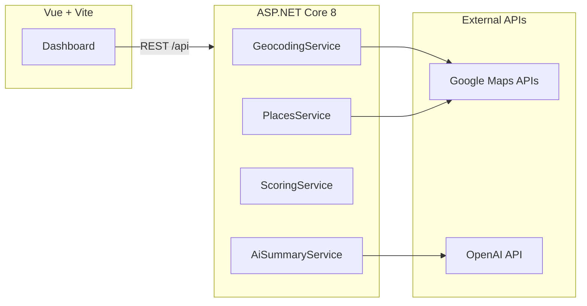

# NeighborhoodIntel

**Block-level location intelligence for real estate** — geocode an address, pull live amenity counts from Google Places, score the area in C#, and optionally generate a buyer-focused narrative with OpenAI.

> I wanted to build something that reflects how agents evaluate locations, so I created a location intelligence tool that combines real-world data from APIs with AI-generated insights to help assess neighborhoods quickly.

---

## Live demo (Vercel)

Production build (set **`VITE_API_BASE_URL`** on Vercel and CORS on your API for full analyze + AI flows):

- **https://neighborhood-intel-amirs-projects-74ab5506.vercel.app**

The global slug `neighborhood-intel.vercel.app` may point to a different project; use your team URL or a custom domain.

---

## Why this project

| | |
|---|---|
| **Real APIs** | Google Geocoding + Places (Nearby Search) |
| **Real logic** | Weighted scoring and normalization in C#, not CRUD-only |
| **AI that matters** | Short advisor-style summary from structured counts + score |
| **Modern UI** | Vue 3 + Vite dashboard with map embed and saved searches |

---

## Features

1. **Address input** — natural language (e.g. `123 King St Toronto`); backend resolves coordinates via Geocoding API.
2. **Nearby places** — schools, grocery, parks, transit, restaurants within a selectable radius (500 m / 1 km / custom).
3. **Neighborhood score** — e.g. `Neighborhood Score: 78/100` from a transparent weighted formula in `ScoringService.cs`.
4. **AI summary** — “Analyze Location” calls the API with counts + score; GPT-4o-mini returns a concise evaluation for buyers.
5. **Vue dashboard** — address bar, stat cards, score gauge, AI panel, optional Google Map embed.

---

## Architecture



| Layer | Tech |
|--------|------|
| Frontend | Vue 3, Vite, Axios |
| Backend | ASP.NET Core 8 Web API |
| Maps | Geocoding, Places (Nearby), optional Maps JS embed |
| LLM | OpenAI Chat Completions (`gpt-4o-mini`) |

---

## Repository layout

```
neighborhood-intel/
├── backend/                 # ASP.NET Core API
│   ├── Controllers/         # POST /api/analyze-location, /api/ai-summary, GET /api/autocomplete
│   ├── Services/
│   └── Models/
├── frontend/                # Vue SPA (deploy this folder to Vercel)
└── docs/
    └── DEPLOYMENT.md        # GitHub + Vercel + API hosting
```

---

## API reference

Base path: `/api` (Vite dev server proxies `http://localhost:5173/api` → `http://localhost:5000/api`).

| Method | Path | Body / query | Response highlights |
|--------|------|----------------|----------------------|
| `POST` | `/api/analyze-location` | `{ "address": string, "radiusMeters": number }` | `counts`, `score`, `scoreLabel`, `latitude`, `longitude`, `address` |
| `POST` | `/api/ai-summary` | `{ "address", "counts", "score" }` | `{ "summary": string }` |
| `GET` | `/api/autocomplete` | `?input=` | Google Places address predictions |

Raw Places payloads can be extended in `PlacesService` / response DTOs if you want to expose them for debugging.

---

## Scoring (C#)

Caps per category, weighted sum, normalized to **0–100**. See `backend/Services/ScoringService.cs` for the exact formula and labels (Poor → Excellent).

---

## Local development

### Prerequisites

- [.NET 8 SDK](https://dotnet.microsoft.com/download)
- Node 18+ and npm
- Google Cloud project with **Geocoding**, **Places**, and (for autocomplete / map) **Places API** / Maps JS enabled
- [OpenAI API key](https://platform.openai.com/api-keys)

### Backend

```powershell
cd backend
copy appsettings.Development.example.json appsettings.Development.json
# Edit appsettings.Development.json — set GoogleMaps:ApiKey and OpenAI:ApiKey
dotnet run
```

Runs at `http://localhost:5000` by default. You can also use environment variables `GoogleMaps__ApiKey` and `OpenAI__ApiKey`.

### Frontend

```powershell
cd frontend
npm install
copy .env.example .env
# Optional: VITE_GOOGLE_MAPS_KEY for the embed
npm run dev
```

Open `http://localhost:5173`.

---

## Environment variables

### Backend (`appsettings` or env)

| Key | Purpose |
|-----|---------|
| `GoogleMaps:ApiKey` | Geocoding, Places Nearby, autocomplete |
| `OpenAI:ApiKey` | AI neighborhood summary |
| `Cors:AllowedOrigins` | JSON array of allowed browser origins (add your Vercel URL) |

### Frontend (`.env` / Vercel)

| Key | Purpose |
|-----|---------|
| `VITE_GOOGLE_MAPS_KEY` | Map iframe / JS (optional) |
| `VITE_API_BASE_URL` | **Production only** — origin of the .NET API, no trailing slash (e.g. `https://api.yourdomain.com`). Omit locally so `/api` uses the Vite proxy. |

---

## Deployment

See **[docs/DEPLOYMENT.md](docs/DEPLOYMENT.md)** for: creating a public GitHub repo, Vercel (frontend), and hosting the ASP.NET API (Railway, Azure, Render, etc.) with CORS and env vars.

---

## Suggested GitHub repository name

Slug: **`neighborhood-intel`** — short, searchable, matches the product name **NeighborhoodIntel**.

---

## License

MIT — see [LICENSE](LICENSE).
