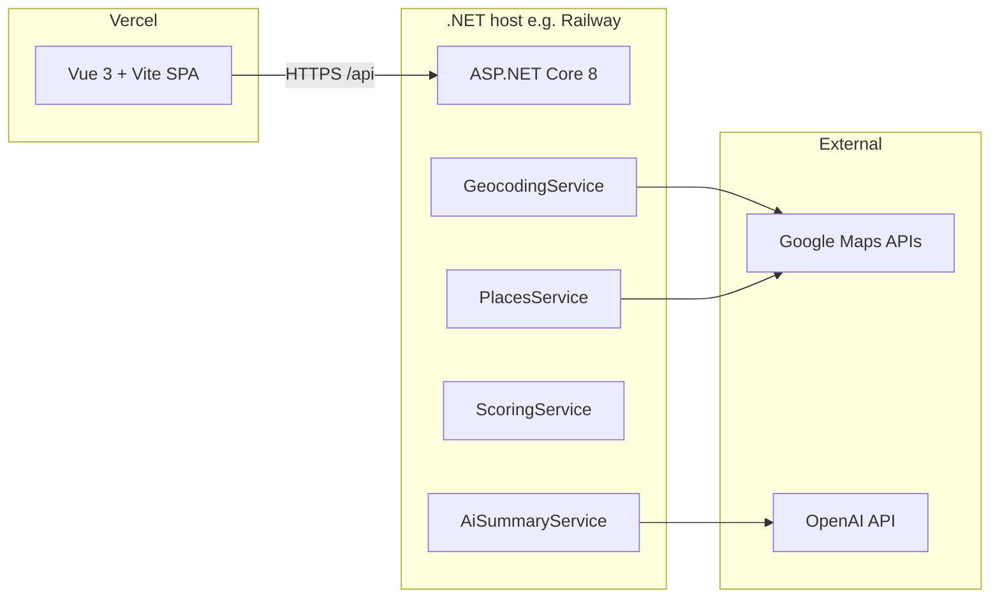

# NeighborhoodIntel

**Neighborhood intelligence for real estate** — enter an address, get live amenity counts from Google Places, a transparent **C#** neighborhood score, an optional **OpenAI** buyer-style summary, and an optional **Google Maps** embed in the browser.

> Combines real API data with a small scoring model and optional AI narrative so you can compare locations quickly.

---

## Live demo

Deploy your own **Vue** frontend on **Vercel** and **ASP.NET Core** API on **Railway** (or any .NET host). Example production URL shape:

- **Frontend:** `https://<your-project>.vercel.app`
- **API:** `https://<your-service>.up.railway.app`

Set **`VITE_API_BASE_URL`** on Vercel to the API origin (with `https://`, no trailing slash) and configure **CORS** on the API (see [Environment variables](#environment-variables)). Redeploy the frontend after changing `VITE_*` vars.

---

## Why this project

| | |
|---|---|
| **Real APIs** | Google Geocoding, Places (Nearby Search, Autocomplete) |
| **Real logic** | Weighted scoring and caps in `ScoringService.cs` (0–100 + labels) |
| **AI** | Short advisor-style summary from counts + score (`gpt-4o-mini` via OpenAI SDK) |
| **Modern UI** | Vue 3 + Vite: search, suggestions, stats, score, AI panel, optional map |

---

## Features

1. **Address search** — natural language (e.g. `123 King St, Toronto`); **live suggestions** via `GET /api/autocomplete` (server-side Google Places).
2. **Analyze** — `POST /api/analyze-location` geocodes the address, loads nearby **schools, parks, grocery, transit, restaurants** within **500 m / 1 km / 2 km**.
3. **Neighborhood score** — weighted formula in C# (e.g. Poor → Excellent); see `ScoringService.cs`.
4. **AI summary** — optional “explain this neighborhood” using structured counts + score (`POST /api/ai-summary`).
5. **Map embed** — optional; requires **`VITE_GOOGLE_MAPS_KEY`** on the frontend (Maps JavaScript API in the browser). Server-side calls use **`GoogleMaps__ApiKey`** on the API host.

---

## Architecture



| Layer | Tech |
|--------|------|
| Frontend | Vue 3, Vite, Axios |
| Backend | ASP.NET Core 8 Web API |
| Maps | Geocoding, Places (Nearby + Autocomplete), optional Maps JS (browser key) |
| LLM | OpenAI Chat (`gpt-4o-mini`) |

**Split hosting:** the SPA and API use **different origins**, so the API must send **CORS** headers for your Vercel URL(s). Preview deploys use random `*.vercel.app` hostnames; this repo can allow those when your configured origins include a `vercel.app` production URL (see `Program.cs`).

---

## Repository layout

```
neighborhood-intel/
├── backend/                 # ASP.NET Core API (Docker / Railway root = backend)
│   ├── Controllers/         # /api/analyze-location, /api/ai-summary, /api/autocomplete
│   ├── Services/
│   └── Models/
├── frontend/                # Vue SPA (Vercel build uses root vercel.json)
├── docs/
│   ├── DEPLOYMENT.md
│   └── RAILWAY.md
├── vercel.json              # Root: install/build frontend, output frontend/dist
└── README.md
```

---

## API reference

**Local dev:** Vite proxies `http://localhost:5173/api` → `http://localhost:5000/api` (see `frontend/vite.config.js`).

**Production:** set `VITE_API_BASE_URL` to the API origin; Axios uses `{origin}/api`.

| Method | Path | Body / query | Response highlights |
|--------|------|----------------|----------------------|
| `POST` | `/api/analyze-location` | `{ "address": string, "radiusMeters": number }` | `counts`, `score`, `scoreLabel`, `latitude`, `longitude`, `address`, `places` |
| `POST` | `/api/ai-summary` | `{ "address", "counts", "score" }` | `{ "summary": string }` |
| `GET` | `/api/autocomplete` | `?input=` | `{ "predictions": [...] }` |

---

## Scoring (C#)

Caps per category, weighted sum, normalized to **0–100**. Labels: Poor → Below Average → Average → Good → Excellent. See `backend/Services/ScoringService.cs`.

---

## Local development

### Prerequisites

- [.NET 8 SDK](https://dotnet.microsoft.com/download)
- Node 18+ and npm
- Google Cloud: **Geocoding API**, **Places API** (Nearby, Autocomplete, etc.)
- [OpenAI API key](https://platform.openai.com/api-keys) (optional for AI summary)

### Backend

```powershell
cd backend
copy appsettings.Development.example.json appsettings.Development.json
# Edit appsettings.Development.json — set GoogleMaps:ApiKey and OpenAI:ApiKey
dotnet run
```

Listens on `http://localhost:5000` by default. Or use env vars `GoogleMaps__ApiKey` and `OpenAI__ApiKey`.

### Frontend

```powershell
cd frontend
npm install
copy .env.example .env
# Optional: VITE_GOOGLE_MAPS_KEY for the map widget
npm run dev
```

Open `http://localhost:5173`.

---

## Environment variables

### Backend (`appsettings`, User Secrets, or host env)

| Key | Purpose |
|-----|---------|
| `GoogleMaps__ApiKey` | Server: Geocoding, Places Nearby, Autocomplete |
| `OpenAI__ApiKey` | AI summary |
| `Cors:AllowedOrigins` | Array in JSON config (local dev defaults include localhost) |
| `CORS_ALLOWED_ORIGINS` | Comma-separated browser origins (e.g. `https://myapp.vercel.app`) — **no trailing slash** |
| `CORS_ALLOW_VERCEL_PREVIEWS` | Optional: `true` / `false` / omit — overrides auto `*.vercel.app` preview behavior (see `Program.cs`) |
| `PORT` | Set by PaaS (e.g. Railway); Kestrel binds to it |

### Frontend (`.env` locally, **Vercel** project settings in production)

| Key | Purpose |
|-----|---------|
| `VITE_API_BASE_URL` | **Production:** full API origin with `https://`, no trailing slash, **no** `/api` suffix. Omit locally to use Vite proxy. |
| `VITE_GOOGLE_MAPS_KEY` | **Optional:** browser Maps JS API key for the embed (separate restrictions from server key). |

---

## Deployment

- **[docs/DEPLOYMENT.md](docs/DEPLOYMENT.md)** — GitHub + Vercel overview  
- **[docs/RAILWAY.md](docs/RAILWAY.md)** — API on Railway (`backend` root directory, Docker)

---

## GitHub repository “About” (copy-paste)

Set in the repo **⚙ Settings → General → Repository details** (or the **About** cog on the repo home):

**Description (short):**

> Vue 3 + ASP.NET Core 8: address autocomplete, Google Places amenity counts, C# neighborhood score, optional OpenAI summary, optional Maps embed.

**Topics (suggestions):**  
`vue` `vite` `aspnet-core` `csharp` `dotnet` `google-maps` `google-places` `openai` `real-estate` `vercel` `railway`

---

## License

MIT — see [LICENSE](LICENSE).
